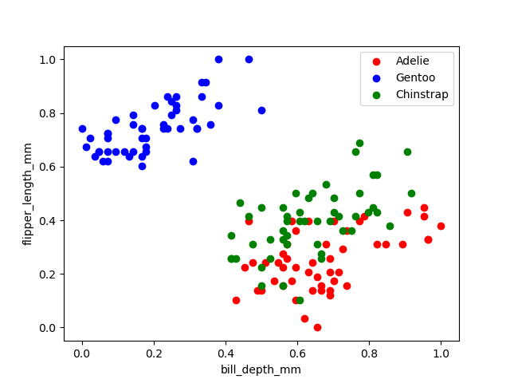
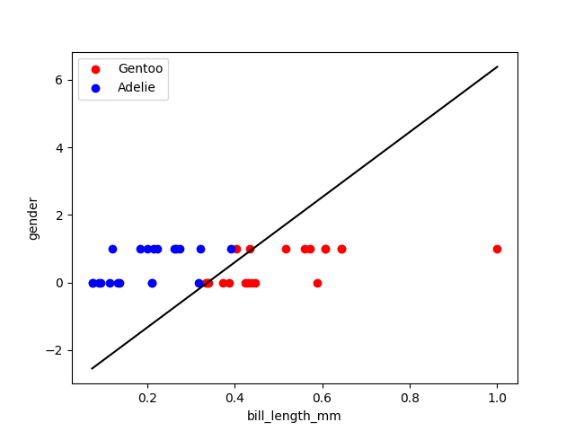
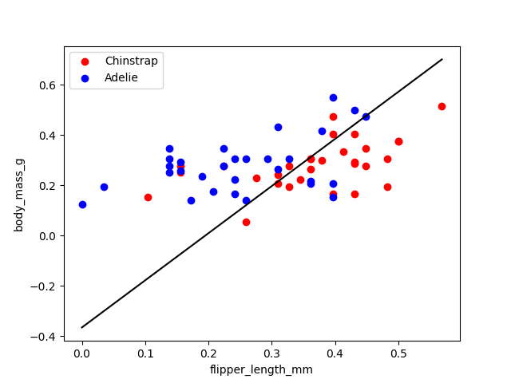
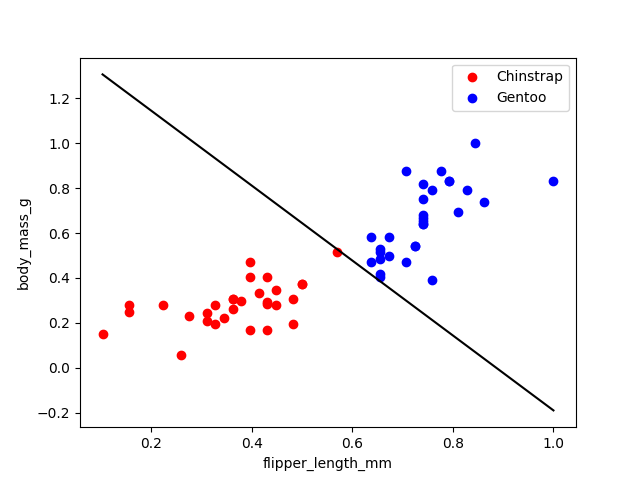
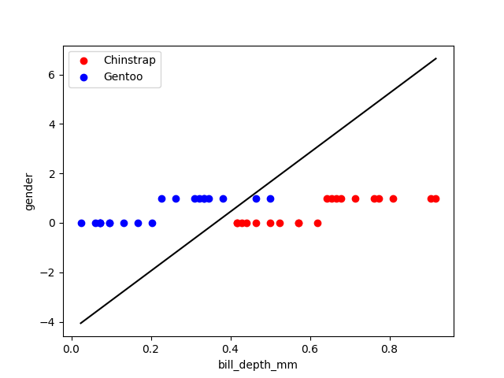
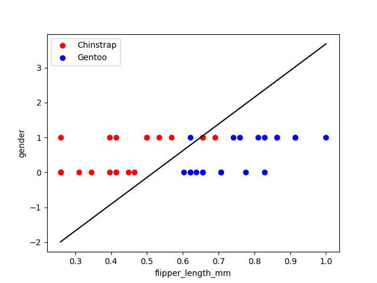

# Team CS_H38
| Name      | ID |
| --------------------------| ----------------- |
| Mazen Mohamed Bakr        | 20191700479       |
| Mohamed Ibrahim Mohamed   | 20191700490       |
| Waleed Mohamed Mohamed    | 20191700747       |

# Table of Figures

| Feature | &emsp; Figure | Feature | &emsp; Figure |
| -------------------------- | ----------------- | -------------------------- | ----------------- |
| Bill Length and Bill Depth |  | Bill Length and Flipper Length |  |
| Bill Depth and Flipper Length |  | Bill Length and Body Mass |  |
| Bill Depth and Body Mass |  | Flipper Length and Body Mass | |
| Bill Length and Gender |  | Bill Depth and Gender |  |
| Flipper Length and Gender |  | Body Mass and Gender |  |

# Introduction

The penguin dataset is a dataset that contains information about the penguins. The dataset contains 150 rows and 6 columns. The columns are: species, bill_length_mm, bill_depth_mm, flipper_length_mm, gender, body_mass  

<strong> Note that all the experiments are done on 0.01 Learning Rate and 100 Epochs using bias </strong>

# Adelie and Gentoo 

### Bill Length and Bill Depth
| Train Accuracy: 100% | Test Accuracy: 100% | Confusion Matrix: |
| --------------------------  | -------------------------- | ----------------- |
|  |  |  |

### Bill Length and Flipper Length
| Train Accuracy: 100% | Test Accuracy: 100% | Confusion Matrix: |
| --------------------------  | -------------------------- | ----------------- |
|  |  |  |

### Bill Depth and Flipper Length
| Train Accuracy: 100% | Test Accuracy: 97.5% | Confusion Matrix: |
| --------------------------  | -------------------------- | ----------------- |
|  |  |  |

### Bill Length and Body Mass
| Train Accuracy: 93.3% | Test Accuracy: 95.0% | Confusion Matrix: |
| --------------------------  | -------------------------- | ----------------- |
|  |  |  |

### Bill Depth and Body Mass

| Train Accuracy: 100% | Test Accuracy: 97.5% | Confusion Matrix: |
| --------------------------  | -------------------------- | ----------------- |
|  |  |  |

### Flipper Length and Body Mass

| Train Accuracy: 100% | Test Accuracy: 97.5% | Confusion Matrix: |
| --------------------------  | -------------------------- | ----------------- |
|  |  |  |

### Bill Length and Gender

| Train Accuracy: 95% | Test Accuracy: 90% | Confusion Matrix: |
| --------------------------  | -------------------------- | ----------------- |
|  |  |  |

### Bill Depth and Gender

| Train Accuracy: 100% | Test Accuracy: 95% | Confusion Matrix: |
| --------------------------  | -------------------------- | ----------------- |
|  |  |  |

### Flipper Length and Gender

| Train Accuracy: 100% | Test Accuracy: 97.5% | Confusion Matrix: |
| --------------------------  | -------------------------- | ----------------- |
|  |  |  |

### Body Mass and Gender

| Train Accuracy: 96.6% | Test Accuracy: 97.5% | Confusion Matrix: |
| --------------------------  | -------------------------- | ----------------- |
|  |  |  |

## Conclusion

As we can see from the results, the Adelie and Gentoo penguins are very easy to distinguish. The Adelie penguins are smaller than the Gentoo penguins. The Adelie penguins have a smaller bill length and depth than the Gentoo penguins. The Adelie penguins have a smaller body mass than the Gentoo penguins. The Adelie penguins have a smaller flipper length than the Gentoo penguins.

[comment]: <> (************************************)
# Adelie and Chinstrap

### Bill Length and Bill Depth
| Train Accuracy: 100% | Test Accuracy: 97.5% | Confusion Matrix: |
| --------------------------  | -------------------------- | ----------------- |
|  |  |  |

### Bill Length and Flipper Length
| Train Accuracy: 95% | Test Accuracy: 92.5% | Confusion Matrix: |
| --------------------------  | -------------------------- | ----------------- |
|  |  |  |

### Bill Depth and Flipper Length
| Train Accuracy: 68.3% | Test Accuracy: 80.0% | Confusion Matrix: |
| --------------------------  | -------------------------- | ----------------- |
|  |  |  |

### Bill Length and Body Mass
| Train Accuracy: 96.6% | Test Accuracy: 95.0% | Confusion Matrix: |
| --------------------------  | -------------------------- | ----------------- |
|  |  |  |

### Bill Depth and Body Mass

| Train Accuracy: 50% | Test Accuracy: 50% | Confusion Matrix: |
| --------------------------  | -------------------------- | ----------------- |
|  |  |  |

### Flipper Length and Body Mass
| Train Accuracy: 76.6% | Test Accuracy: 80.0% | Confusion Matrix: |
| --------------------------  | -------------------------- | ----------------- |
|  |  |  |

### Bill Length and Gender
| Train Accuracy: 100.0% | Test Accuracy: 97.5% | Confusion Matrix: |
| --------------------------  | -------------------------- | ----------------- |
|  |  |  |

### Bill Depth and Gender

| Train Accuracy: 50% | Test Accuracy: 50% | Confusion Matrix: |
| --------------------------  | -------------------------- | ----------------- |
|  |  |  |

### Flipper Length and Gender

| Train Accuracy: 53.3% | Test Accuracy: 50.0% | Confusion Matrix: |
| --------------------------  | -------------------------- | ----------------- |
|  |  |  |

### Body Mass and Gender

| Train Accuracy: 50.0% | Test Accuracy: 50.0% | Confusion Matrix: |
| --------------------------  | -------------------------- | ----------------- |
|  |  |  |

## Conclusion

Adelie and Chinstrap penguins are hard to classify in most cases, but the features bill length and bill depth, bill length and gender were the best features to classify with.

[comment]: <> (************************************)

# Gentoo and Chinstrap

### Bill Length and Bill Depth
| Train Accuracy: 100% | Test Accuracy: 95.0% | Confusion Matrix: |
| --------------------------  | -------------------------- | ----------------- |
|  |  |  |

### Bill Length and Flipper Length
| Train Accuracy: 100% | Test Accuracy: 82.5% | Confusion Matrix: |
| --------------------------  | -------------------------- | ----------------- |
|  |  |  |

### Bill Depth and Flipper Length
| Train Accuracy: 100% | Test Accuracy: 95.0% | Confusion Matrix: |
| --------------------------  | -------------------------- | ----------------- |
|  |  |  |

### Bill Length and Body Mass
| Train Accuracy: 98.3% | Test Accuracy: 97.5% | Confusion Matrix: |
| --------------------------  | -------------------------- | ----------------- |
|  |  |  |

### Bill Depth and Body Mass
| Train Accuracy: 100% | Test Accuracy: 95% | Confusion Matrix: |
| --------------------------  | -------------------------- | ----------------- |
|  |  |  |

### Flipper Length and Body Mass
| Train Accuracy: 100% | Test Accuracy: 92.5% | Confusion Matrix: |
| --------------------------  | -------------------------- | ----------------- |
|  |  |  |

### Bill Length and Gender
| Train Accuracy: 55.0% | Test Accuracy: 65.0% | Confusion Matrix: |
| --------------------------  | -------------------------- | ----------------- |
|  |  |  |

### Bill Depth and Gender

| Train Accuracy: 100% | Test Accuracy: 95% | Confusion Matrix: |
| --------------------------  | -------------------------- | ----------------- |
|  |  |  |

### Flipper Length and Gender

| Train Accuracy: 100% | Test Accuracy: 90.0% | Confusion Matrix: |
| --------------------------  | -------------------------- | ----------------- |
|  |  |  |

### Body Mass and Gender

| Train Accuracy: 98.3% | Test Accuracy: 95.0% | Confusion Matrix: |
| --------------------------  | -------------------------- | ----------------- |
|  |  |  |

## Conclusion

Gentoo and Chinstrap penguins are easier to classify than Adelie and Chinstrap, the features gender, bill depth and body_mass were the best features to classify with.

# Overall Conclusion

Overall, Adelie and Chinstrap are the hardest to classify, Adelie and Gentoo are the easiest to classify. The best features to classify with are bill length and bill depth.

